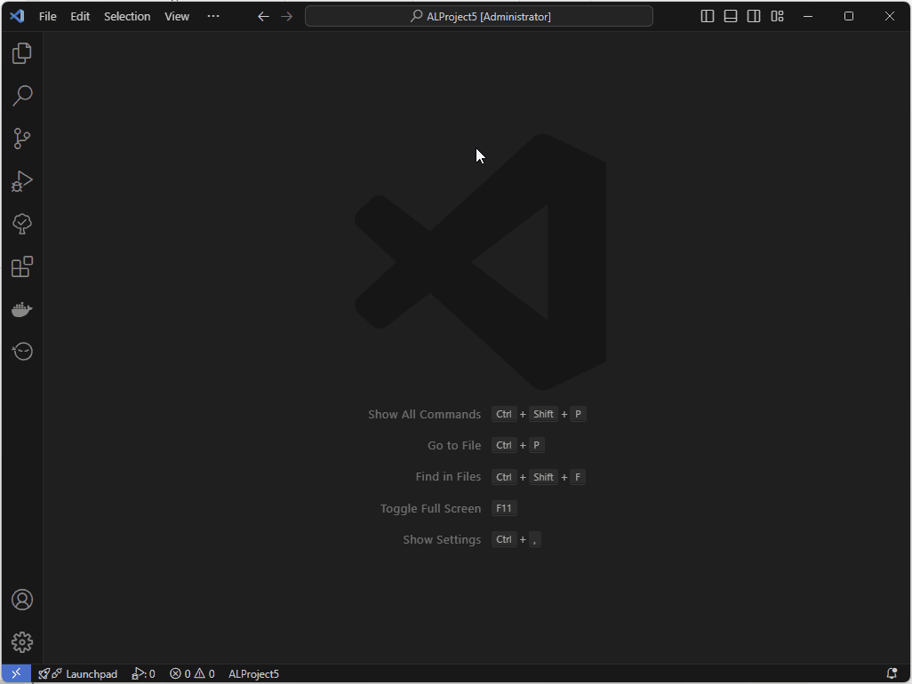
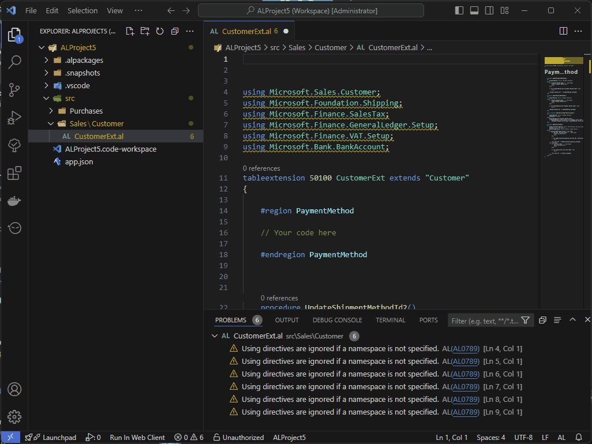
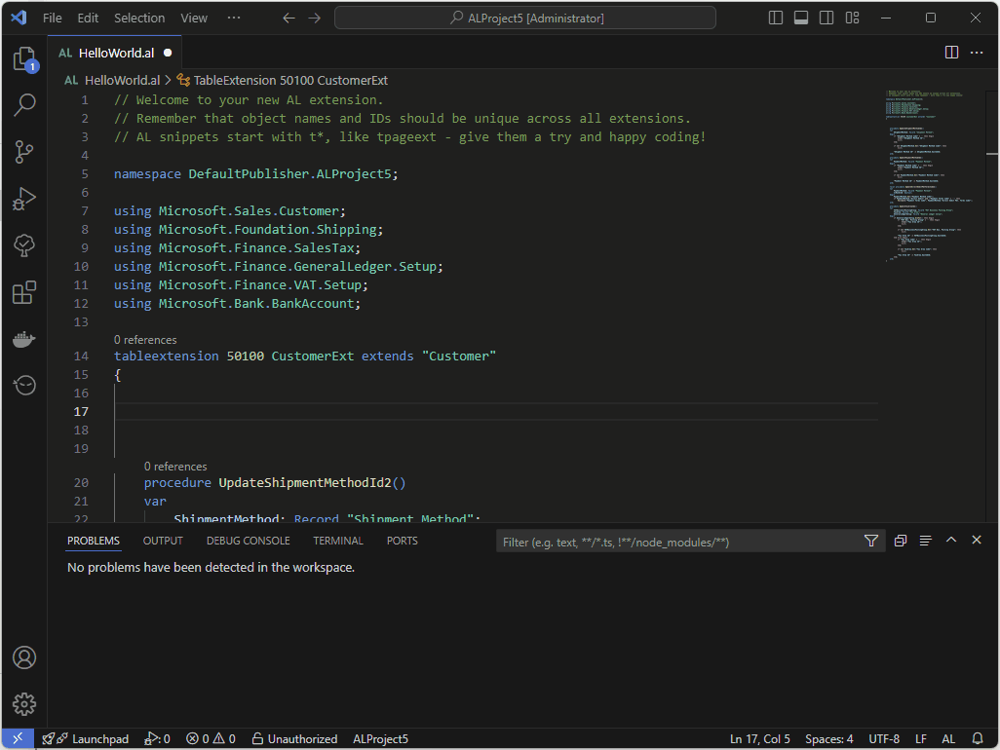
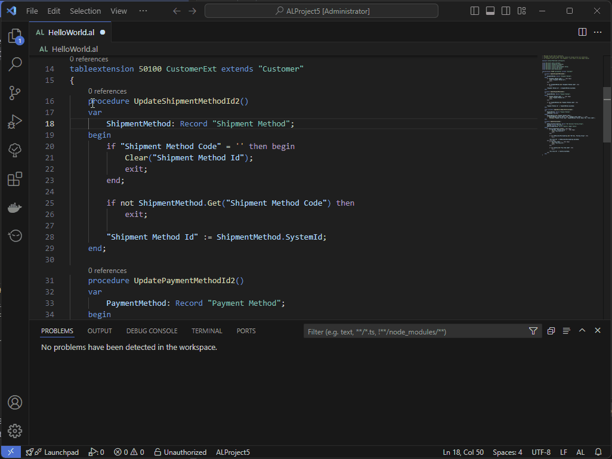
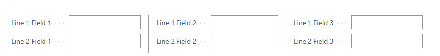
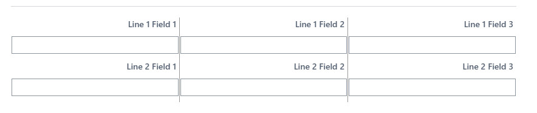

# Advanced Tools Suite for AL Language
>A complete suite of utilities to enhance your development experience with AL Language

# Features
These features are concluded at this moment:

## launch.json manager
Store all launch.json files in a local or shared folder and select which one to use for the current project. 
With these features you can easily share launchers with your colleagues:

* Import launch.json file on your workspace by command **ATS: Import 'launch.json'**
* Export launch.json file of your workspace by command **ATS: Export 'launch.json'**
* Run Business Central Client by command **ATS: Run Business Central Client**

## Namespace utilities

* Set object namespace based on current file path (max 4 elements) by command **ATS: Set object namespace based on file path** 
   

* Namespace completion providers based on:
    - Current File path if **ats.UseObjectFilePathAsNamespace** setting is enabled (max 4 elements)
    - Default Root Namespace defined by **al.RootNamespace** setting
    - Additional custom Namespaces defined in **ats.DefaultNamespaces** setting

## Region utilities

* Create regions by snippet **tregion**

* Create region for the selected code in the current editor by command **ATS: Create region by selection**

# Snippets

## tsingleLineFields:
An easy way to organize page fields in a single-line structure. 
With this structure you can create a complex grid like this: 

##  tsingleLineFieldsWithCaptionTop:
An easy way to organize page fields in a single-line structure with caption at the top.  
With this structure you can create a complex grid like this: 

## tregion:
An easy way to create regions in AL objects

# Requirements
* AL Language extension
