# Advanced Tools Suite for AL Language
>A complete suite of utilities to enhance your development experience with AL Language

If you want to support my work:

# Features
These features are concluded at this moment:

## AL Object Explorer
* Info and statistics of the current AL Object in status bar
 
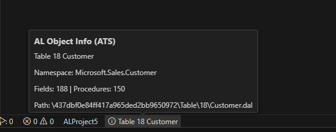

* **ATS: AL Object Explorer**: navigates through the elements of the current AL object
 
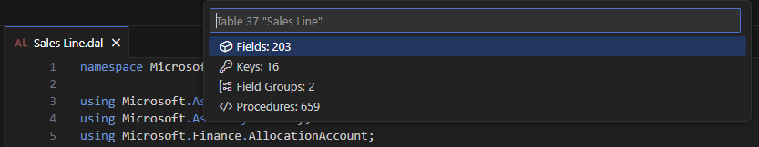

* **ATS: Show all Fields**: Show and search fields of the current AL Object
 
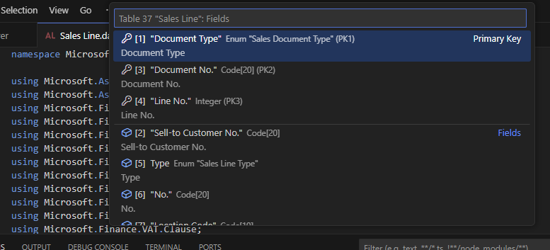

* **ATS: Show all Table Keys**: Show and search keys of the current AL Table
 
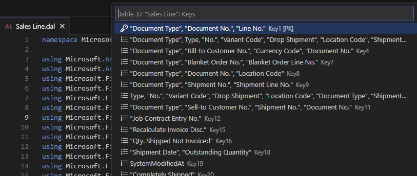

* **ATS: Show all Procedures**: Show and search functions of the current AL Object
 
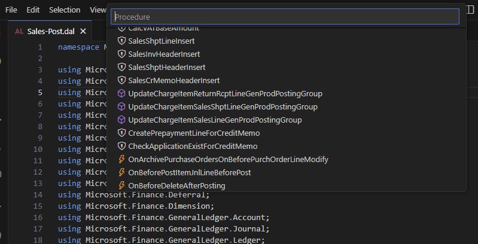
 
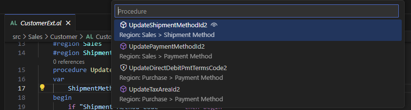

* **ATS: Show all Page Actions**: Show and search page actions of the current AL Object
 
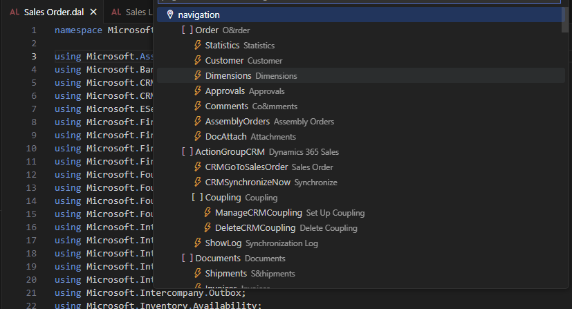

* **ATS: Show all Dataitems**: Show the complete dataitems structure of the current AL Report
 
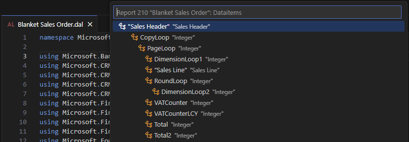

* **ATS: Show all Regions**: Show the complete regions structure of the current AL Object
 
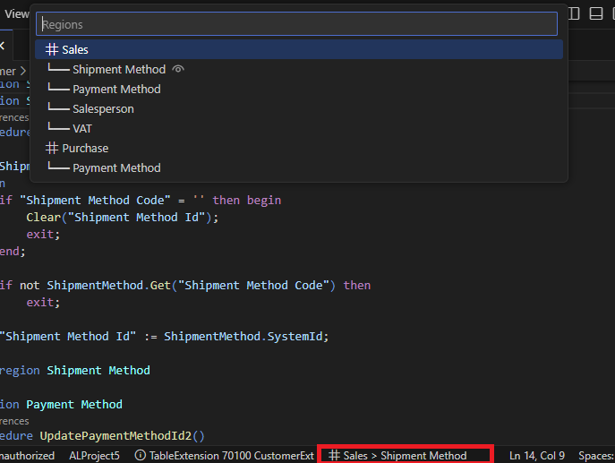

* **ATS: Show open AL objects**: Show detailed list of open AL Objects
 
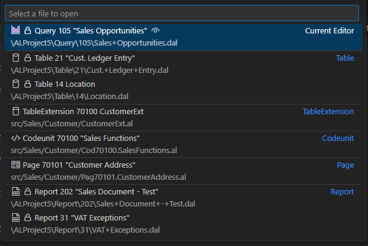

## launch.json manager
Store all launch.json files in a local or shared folder and select which one to use for the current project. 
With these features you can easily share launchers with your colleagues:

* Import launch.json file on your workspace by command **ATS: Import 'launch.json'**
* Export launch.json file of your workspace by command **ATS: Export 'launch.json'** 
* Open launch.json file of your workspace by command **ATS: Open 'launch.json'** 
* Change default startup object on launch.json file by command **ATS: Change default startup object and run Business Central**
 
 

## Run Business Central
The command `ATS: Run Business Central` allows running the Business Central client by selecting the configuration to use among the various configurations defined in the launch.json file.
 

You can define `URL Forwarding Rules` in vscode settings to run Business Central using a different URL than the one defined in the launch.json file for each configuration. This can be useful for custom setups or scenarios where URL conversion is needed.
 
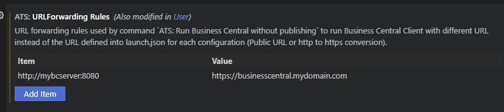

**Use Cases for Forwarding Rules:** 
* Public URL:
  Run the Business Central client using a public URL different from the local one specified in the launch.json file. 

* HTTP to HTTPS Conversion:
  Automatically convert the URL from HTTP to HTTPS to ensure a secure connection to the Business Central client.

**Rule Mechanism:** 
You can define rules to replace the entire URL or part of it. 
When the command `ATS: Run Business Central` is executed, the specified URL is replaced or modified according to the forwarding rules. 
Example: 
Configuration in launch.json: http://mybcserver:8080 
Applied Rule: Redirect to https://businesscentral.mydomain.com 
These rules make running the Business Central client more flexible and secure without requiring manual adjustments to every configuration.

## Namespace utilities

* Set object namespace based on current file path by command **ATS: Set object namespace based on file path** 
 

* Namespace completion providers based on:
    - Current File path if **ats.UseObjectFilePathAsNamespace** setting is enabled
    - Default Root Namespace defined by **al.RootNamespace** setting
    - Default Root Namespace defined by **ats.RootNamespace** setting
    - Additional custom Namespaces defined in **ats.DefaultNamespaces** setting
 
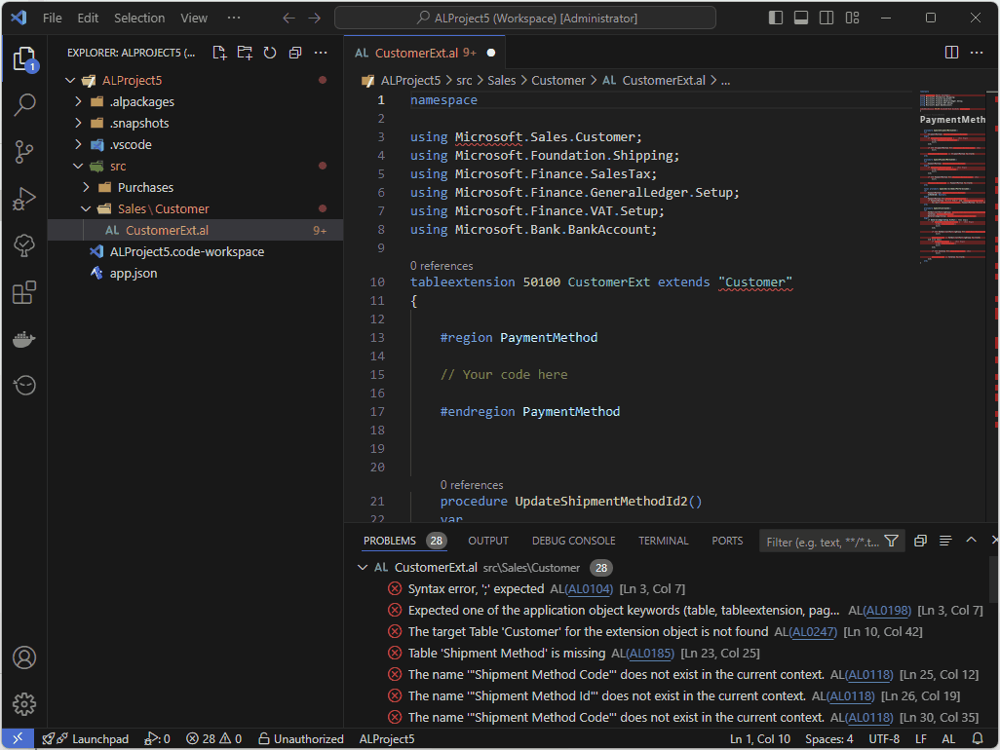

## Region utilities

* Create regions by snippet **tregion**
 

* Create region for the selected code in the current editor by command **ATS: Create region by selection**
 
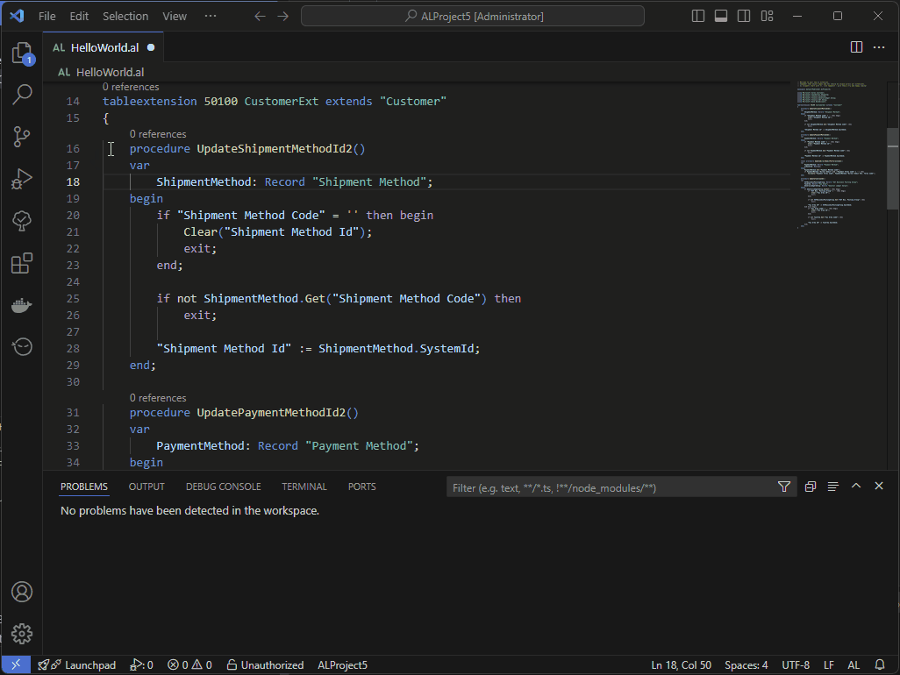

* Region Path info on status bar:
 
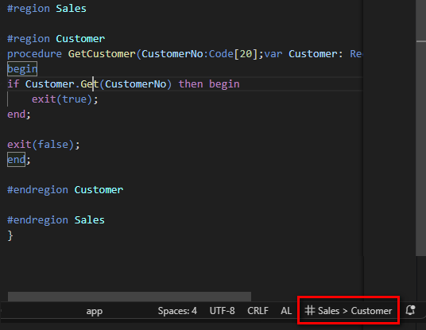

* Show the complete structure of regions in the current document by command **ATS: Show all regions**
 

# Snippets

## tsingleLineFields:
An easy way to organize page fields in a single-line structure. 
With this structure you can create a complex grid like this: 

##  tsingleLineFieldsWithCaptionTop:
An easy way to organize page fields in a single-line structure with caption at the top.  
With this structure you can create a complex grid like this: 

# Extension settings
* `ATS.DefaultLaunchArchiveFolder`: Default archive folder for import/export utiltities of launch.json file;  
* `ATS.UseObjectFilePathAsNamespace`: Allow usage of object file path for namespace declarations (default = false). The number of positions included depends on the value defined in the `ATS.MaxNamespaceSize` setting;
* `ATS.RootNamespace`: Namespace prefix to use for diagnositc rules and suggestions (if specified overrides the use of the `al.rootNamespace` setting);
* `ATS.DefaultNamespaces`: List of default namespaces that can be used for AL objects;  
* `ATS.MaxNamespaceSize`: No. of max elements expected for namespace declaration in AL objects (default = 5);  
* `ATS.EnableNamespaceDiagnostics`: Enable or disable warnings for wrong or missing namespace declarations in AL objects (default = false); 
    Allowed values: 
    - `ATS.RootNamespace` or `AL.RootNamespace` setting value;  
    - Object file path (if `ATS.UseObjectFilePathAsNamespace` setting is enabled);
    - Custom namespaces defined in `ATS.DefaultNamespaces` setting.
* `ATS.NamespaceMandatory`: Enable or disable errors for missing namespace declarations in AL objects (default = false). This setting will be used only if the `ATS.EnableNamespaceDiagnostics` setting is enabled;
* `ATS.URLForwardingRules`: Conversion rules used by command `ATS: Run Business Central` to run Business Central Client with different URL instead of the URL defined into launch.json for each configuration (Public URL or http to https conversion);
* `ATS.ObjectInfoOnStatusBar`: Enable visibility of status bar with AL object info;
* `ATS.RegionInfoOnStatusBar`: Enable visibility of status bar with region details for current line in active editor.

# Requirements
* AL Language extension

# Support my work: Elevate your AL development Experience
As a passionate Business Central developer, I dedicate my free time to creating tools that make AL development smoother, faster, and more enjoyable. My goal is to simplify workflows, introduce practical features, and enhance the daily experience of developers like you.

If my tools have saved you time, boosted your productivity, or simply made your work easier, I'd greatly appreciate your support. By "buying me a coffee," you enable me to continue improving and maintaining these tools, ensuring they remain valuable and up-to-date.

Every contribution, big or small, helps me focus on innovation and delivering even better solutions for the AL development community. Your support truly makes a difference and keeps this journey alive

